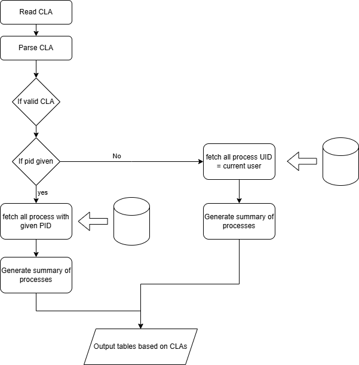

# **README: File Descriptor Monitor Tool**

## **Overview**
This program is a **File Descriptor (FD) Monitor** made by ShenYi Wang that inspects the open file descriptors of running processes on a Linux system using the `/proc` filesystem. It allows users to view FD usage per process, system-wide, by inodes, and in a composite format. Additionally, it provides summary statistics and threshold-based filtering. The program can output results to both the console and files in **text (.txt)** or **binary (.bin)** formats.

---
### **How I Solved the Task**  
This is my flow chart

The implementation of this task was divided into three major parts:  

## **1. Initializing Data Structures and Parsing CLAs**  

To effectively store and manage information about file descriptors (FDs) and their associated details (such as **PID, FD number, target file, and inode**), I designed two key **linked list** structures:  

### **FDNode** (Stores individual file descriptors for each process)  
This structure holds:
- **pid** → The process ID  
- **fd** → File descriptor number  
- **target** → The name or path of the open file  
- **inode** → The inode number associated with the file  
- **next** → Pointer to the next FDNode in the linked list  

Each **FDNode** represents one open file descriptor for a process.  

### **FDSummary** (Stores a summary of FD usage per process)  
This structure tracks:
- **pid** → The process ID  
- **fd_count** → The number of open file descriptors for that process  
- **next** → Pointer to the next FDSummary in the linked list  

This helps efficiently compute and display **FD usage statistics** per process.

Then I parsed the CLAs for so the program knows how and what to output.


## **2. Reading Data from `/proc`**  

To retrieve **live system information**, I read from the **`/proc` filesystem**, which contains information about running processes. The main steps include:  

1. **Iterating through `/proc`**  
   - Open `/proc` and loop through its entries (each entry represents a process with a numeric name).  
   - Check if the entry name is a **valid PID** (i.e., it only contains digits).  

2. **Extracting File Descriptors**  
   - For each process (`/proc/<PID>/fd`), iterate through its open file descriptors.  
   - Use `readlink()` to get the actual file or socket associated with the FD.  
   - Retrieve **inode information** from `/proc/<PID>/fdinfo/<FD>`.  
   - Store this information inside an **FDNode** linked list.  

3. **Handling User-Specific Filters**  
   - If a specific **PID is provided**, the program only collects data for that PID.  
   - If no PID is provided, the program retrieves data for **all processes belonging to the current user**.  

This ensures the program can dynamically **monitor all open file descriptors** while filtering based on user input.


## **3. Processing and Outputting Data**  

Once data is collected, it is processed and displayed in different formats based on the parsed CLA:

- **--per-process**:  
  Displays each file descriptor and its associated process.

- **--systemWide**:  
  Displays each file descriptor along with its associated process and filename.

- **--Vnodes**:  
  Displays a table mapping FD to their corresponding inode numbers.

- **--composite**:  
  Combines process, filename, and inode information into a single table.

- **--summary**:  
  Shows the total number of open file descriptors per process.

- **--threshold**:  
  Displays only processes that exceed a specified file descriptor count threshold.


## **4. Function List and Purpose**

## **Sorting Functions**
### `sortedMerge(FDNode* a, FDNode* b)`
- **Purpose:** Merges two sorted linked lists of `FDNode` structures.
- **Usage:** Used in `mergeSort()` to sort the list of file descriptors by PID and FD.

### `splitList(FDNode* source, FDNode** front, FDNode** back)`
- **Purpose:** Splits a linked list into two halves for merge sort.
- **Usage:** Used in `mergeSort()` to divide the list before sorting.

### `mergeSort(FDNode* head)`
- **Purpose:** Sorts a linked list of `FDNode` structures using merge sort.
- **Usage:** Called to sort `fd_list` before displaying or processing.

### `sortedMergeSum(FDSummary* a, FDSummary* b)`
- **Purpose:** Merges two sorted linked lists of `FDSummary` structures.
- **Usage:** Used in `mergeSortSummary()` to sort the list of FD summaries.

### `splitListSum(FDSummary* source, FDSummary** front, FDSummary** back)`
- **Purpose:** Splits a linked list of `FDSummary` structures into two halves for merge sort.
- **Usage:** Used in `mergeSortSummary()`.

### `mergeSortSummary(FDSummary* head)`
- **Purpose:** Sorts a linked list of `FDSummary` structures using merge sort.
- **Usage:** Called to sort `fd_summary` before displaying the summary table.

---

## **Process Information Functions**
### `uid_t get_process_uid(pid_t pid)`
- **Purpose:** Retrieves the UID of a given process by reading `/proc/[pid]/status`.
- **Usage:** Used in `collect_FD()` to filter processes belonging to the current user.

---

## **Linked List Management Functions**
### `void add_fd(FDNode** fd_list, pid_t pid, int fd, char *target, ino_t inode)`
- **Purpose:** Creates a new `FDNode` entry and inserts it into the linked list.
- **Usage:** Called inside `collect_FD()` to store FD details.

### `void update_fd_summary(FDNode *fd_list, FDSummary **sum_list)`
- **Purpose:** Updates the summary list, counting file descriptors per process.
- **Usage:** Called in `display_tables()` to generate `fd_summary` from `fd_list`.

---

## **File Descriptor Collection Functions**
### `ino_t get_inode(pid_t pid, int fd)`
- **Purpose:** Retrieves the inode number for a given FD by reading `/proc/[pid]/fdinfo/[fd]`.
- **Usage:** Used in `collect_FD()` to fetch inode information for each FD.

### `void collect_FD(FDNode** fd_list, int target_pid)`
- **Purpose:** Collects file descriptor details (FD number, filename, inode) for all or a specific process.
- **Usage:** Called in `display_tables()` to generate `fd_list`.

---

## **Data Display Functions**
### `void display_per_process_table(FDNode *fd_list)`
- **Purpose:** Displays the per-process FD table with PID and FD count.
- **Usage:** Called if `--per-process` flag is set.

### `void display_systemwide_table(FDNode *fd_list)`
- **Purpose:** Displays system-wide FD table with PID, FD, and filename.
- **Usage:** Called if `--systemWide` flag is set.

### `void display_inode_table(FDNode *fd_list)`
- **Purpose:** Displays FD-to-inode mapping table.
- **Usage:** Called if `--Vnodes` flag is set.

### `void display_composite_table(FDNode *fd_list)`
- **Purpose:** Displays a comprehensive FD table with PID, FD, filename, and inode.
- **Usage:** Called if `--composite` flag is set (default).

### `void display_summary_table(FDSummary *fd_sum)`
- **Purpose:** Displays an FD summary table showing total FDs per process.
- **Usage:** Called if `--summary` flag is set.

### `void display_threshold_table(FDNode *fd_list, FDSummary *fd_sum, int threshold)`
- **Purpose:** Displays only processes that exceed the specified FD threshold.
- **Usage:** Called if `--threshold=N` is set.

---

## **File Output Functions**
### `void save_composite_table_txt(FDNode *fd_list)`
- **Purpose:** Saves the composite FD table in text format (`compositeTable.txt`).
- **Usage:** Called if `--output_TXT` flag is set.

### `void save_composite_table_bin(FDNode *fd_list)`
- **Purpose:** Saves the composite FD table in binary format (`compositeTable.bin`).
- **Usage:** Called if `--output_binary` flag is set.

---

## **Memory Management Functions**
### `void free_fd_list(FDNode *head)`
- **Purpose:** Frees memory allocated for the FD linked list.
- **Usage:** Called in `display_tables()` before exiting.

### `void free_fd_summary(FDSummary *head)`
- **Purpose:** Frees memory allocated for the FD summary linked list.
- **Usage:** Called in `display_tables()` before exiting.

---

## **Core Program Functions**
### `void parse_arguments(int argc, char *argv[], Arguments *args)`
- **Purpose:** Parses command-line arguments and updates the `Arguments` structure.
- **Usage:** Called at the start of `main()`.

### `void display_tables(Arguments* argument)`
- **Purpose:** Manages the collection, sorting, and display of FD tables based on command-line arguments.
- **Usage:** Called in `main()` after parsing arguments.

## **5. Compiling the Program**  

The program is compiled using **GCC** within a make file, with the following compilation flags (when expanded):  

```sh
gcc -Wall -Werror -c showFDtables.c -o showFDtables.o
gcc showFDtables -o showFDtables.o
```

### **Explanation of Compilation Flags**  
- `-Wall` → Enables **all compiler warnings**, helping catch potential issues.  
- `-Werror` → Treats all warnings as **errors**, ensuring strict code quality.  
- `-c` → Compiles the source file (`showFDtables.c`) **without linking**, generating an object file (`showFDtables.o`).  
- `-o showFDtables` → Links the object file to produce the final **executable** (`showFDtables`).  

### **Why I Didn't Use `-std=c99`**  
The `readlink()` function, which is used to retrieve the target of symbolic links in `/proc/<PID>/fd/`, is **not available in C99**. To avoid compatibility issues, the program is compiled using the **default GCC standard** rather than enforcing **C99**.  

To compile and link using the provided **Makefile**, simply run:  

```sh
make
```


## **6. Running the Program**
The program supports multiple command-line arguments. Run it using:
```sh
./showFDtables [OPTIONS]
```

---

### **Command-Line Options & Behavior**  

| **Option**          | **Description** |
|--------------------|-------------|
| `--per-process`    | Display FD information per process (PID & FD only). |
| `--systemWide`     | Display system-wide FD table (PID, FD, filename). |
| `--Vnodes`         | Display FD inode table (FD & inode number). |
| `--composite`      | Display full FD table (PID, FD, filename, inode). |
| `--summary`        | Display a table summarizing number of FDs open per process. |
| `--threshold=X`    | Show only processes exceeding `X` FDs, listing them as `PID (FD Count)`. |
| `--output_TXT`     | Save the composite table in a text file (`compositeTable.txt`). |
| `--output_binary`  | Save the composite table in binary format (`compositeTable.bin`). |
| `<PID>`            | Specify a **single** process ID to analyze (defaults to all user-owned processes). |

### **Handling Multiple Flags**
- The program **supports multiple flags simultaneously**.  
- If **no table options** (`--per-process`, `--systemWide`, `--Vnodes`, `--composite`, `--summary`) are provided, the program **defaults to the composite table** (`--composite`).  

### **Positional Arguments**
- The program **accepts at most one positional argument** for a **specific PID**.
- If **no PID is provided**, it **processes all user-owned running processes**.


## **Examples of Usage**

### **1. Display FD table for all processes (User)**
```sh
./showFDtables --composite
```
### **2. Display system-wide FD table (User)**
```sh
./showFDtables --systemWide
```
### **3. Displays composite graph for specific PID (e.g., PID 1234)**
```sh
./showFDtables 1234 --composite
```
### **4. Display FD summary and threshold filtering**
```sh
./showFDtables --summary --threshold=50
```
(Flag processes with more than **50** file descriptors.)

### **5. Save composite table to files**
```sh
./showFDtables --output_TXT --output_binary
```
(This generates `compositeTable.txt` and `compositeTable.bin`.)

---

## **7.File Output Format**
### **Text File (`compositeTable.txt`)**
Stores output in a human-readable table format:
```
PID        FD    Filename                  Inode      
=============================================
2940063    0     /dev/null                 5         
2940063    1     socket:[28885709]         28885709  
2940063    2     socket:[28885709]         28885709  
...
```

### **Binary File (`compositeTable.bin`)**
Stores output as a raw binary dump of the `FDNode` structures. Can be read in C using:
```c
FILE *file = fopen("compositeTable.bin", "rb");
FDNode node;
while (fread(&node, sizeof(FDNode), 1, file)) {
    printf("PID: %d, FD: %d, Filename: %s, Inode: %lu\n", 
           node.pid, node.fd, node.target, (uintmax_t)node.inode);
}
fclose(file);
```

## References

- **GeeksforGeeks.** (2025, January 24). *snprintf() in C*. GeeksforGeeks.  
  [https://www.geeksforgeeks.org/snprintf-c-library/](https://www.geeksforgeeks.org/snprintf-c-library/)

- **proc(5) - Linux manual page.** (n.d.).  
  [https://man7.org/linux/man-pages/man5/proc.5.html](https://man7.org/linux/man-pages/man5/proc.5.html)

- **proc_pid_fd(5) - Linux manual page.** (n.d.).  
  [https://man7.org/linux/man-pages/man5/proc_pid_fd.5.html](https://man7.org/linux/man-pages/man5/proc_pid_fd.5.html)

